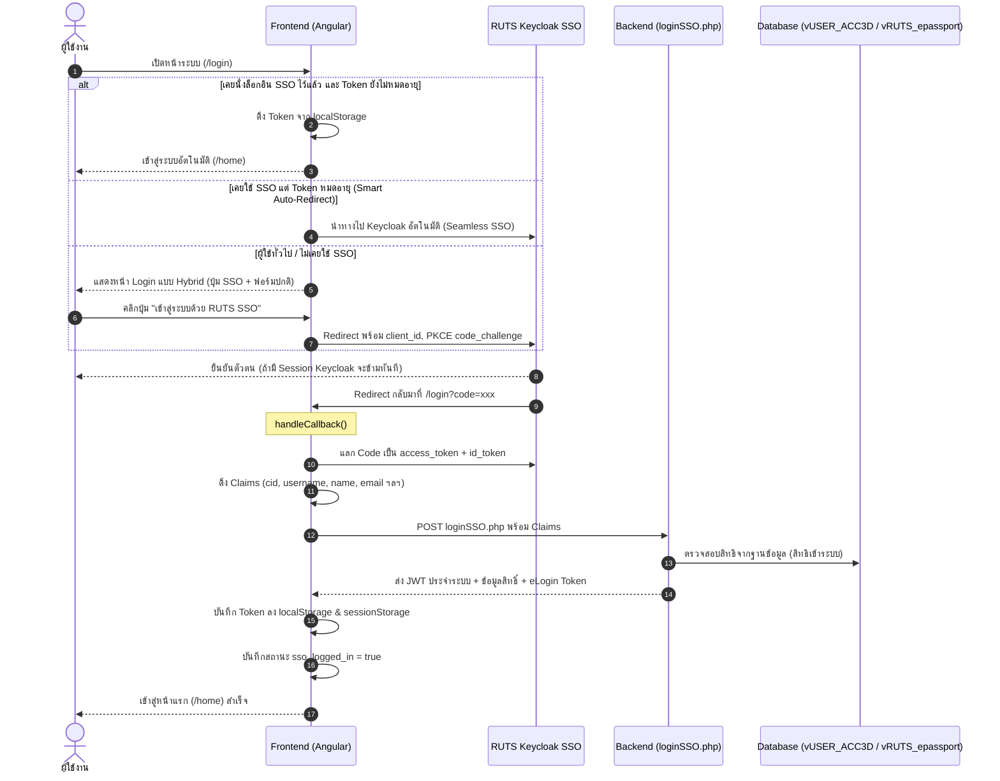

# คู่มือมาตรฐานการติดตั้งและเชื่อมต่อ RUTS SSO (Keycloak OIDC)
## สำหรับพัฒนาระบบสารสนเทศ มหาวิทยาลัยเทคโนโลยีราชมงคลศรีวิชัย
**ฉบับสมบูรณ์ (Production-Ready Standard Guide: Angular + PHP Backend)**

---

## 1. ภาพรวมและสถาปัตยกรรมระบบ (Architecture)

ระบบ Single Sign-On (SSO) ของ มทร.ศรีวิชัย ทำงานบนมาตรฐาน **OpenID Connect (OIDC / OAuth 2.0)** ผ่าน **Keycloak Server** (`https://sso.apps.rmutsv.ac.th`)



---

## 2. สิ่งที่ต้องเตรียมก่อนเริ่มพัฒนา (Prerequisites)

1. **Client ID & Client Secret:** ติดต่อฝ่ายพัฒนาระบบ/สำนักวิทยบริการฯ เพื่อขอลงทะเบียน Client เช่น `ruts-budget`, `ruts-hrms`
2. **Valid Redirect URIs:** แจ้งลงทะเบียน URL Callback ของระบบทั้งฝั่ง Dev และ Production เช่น:
   - `http://localhost:4200/login`
   - `https://<your-domain>/login`
3. **Post Logout Redirect URIs:** เช่น:
   - `http://localhost:4200/login?no_auto=1`
   - `https://<your-domain>/login?no_auto=1`
4. **Web Origins (CORS):** ลงทะเบียน Origin เพื่อให้ Keycloak อนุญาตให้ส่งคำขอจากเบราว์เซอร์

---

## 3. การตั้งค่า Environment ฝั่ง Frontend (Angular)

### `src/environments/environment.ts`
```typescript
export const environment = {
  production: false,
  apiUrlLogin: 'http://localhost/api_v2', // URL Backend API

  oidc: {
    issuer: 'https://sso.apps.rmutsv.ac.th/realms/apps',
    clientId: 'your-client-id', // ระบุ Client ID ที่ได้รับ
    dummyClientSecret: 'your-client-secret', // ระบุ Client Secret ที่ได้รับ
    redirectUri: window.location.origin + '/login',
    postLogoutRedirectUri: window.location.origin + '/login',
    scope: 'openid profile email',
    usePkce: true,
    healthCheckTimeoutMs: 2000,
  }
};
```

---

## 4. โค้ดมาตรฐานฝั่ง Frontend (Angular Services & Components)

### 4.1 Token Storage Service (`token-storage.service.ts`)
> **หัวใจสำคัญ:** ต้องบันทึกลงทั้ง `localStorage` และ `sessionStorage` เพื่อให้ Session ไม่หลุดเมื่อเปิดแท็บใหม่ หรือปิดเปิดเบราว์เซอร์ใหม่

```typescript
import { Injectable } from '@angular/core';
import { BehaviorSubject, Observable } from 'rxjs';

const TOKEN_KEY = 'auth-token';
const USER_KEY = 'auth-user';
const VERSION_KEY = 'auth-version';

@Injectable({
  providedIn: 'root'
})
export class TokenStorageService {
  private authStateSubject = new BehaviorSubject<boolean>(!!this.getToken());
  public authState$: Observable<boolean> = this.authStateSubject.asObservable();

  constructor() {}

  public signOut(): void {
    window.sessionStorage.clear();
    window.localStorage.removeItem(TOKEN_KEY);
    window.localStorage.removeItem(USER_KEY);
    window.localStorage.removeItem(VERSION_KEY);
    window.localStorage.removeItem('sso_logged_in');
    this.authStateSubject.next(false);
  }

  public saveToken(token: string): void {
    window.sessionStorage.removeItem(TOKEN_KEY);
    window.sessionStorage.setItem(TOKEN_KEY, token);
    window.localStorage.removeItem(TOKEN_KEY);
    window.localStorage.setItem(TOKEN_KEY, token);
    this.authStateSubject.next(true);
  }

  public getToken(): string | null {
    return window.localStorage.getItem(TOKEN_KEY) || window.sessionStorage.getItem(TOKEN_KEY);
  }

  public saveUser(user: any): void {
    window.sessionStorage.removeItem(USER_KEY);
    window.sessionStorage.setItem(USER_KEY, JSON.stringify(user));
    window.localStorage.removeItem(USER_KEY);
    window.localStorage.setItem(USER_KEY, JSON.stringify(user));
    this.authStateSubject.next(true);
  }

  public getUser(): any {
    const user = window.localStorage.getItem(USER_KEY) || window.sessionStorage.getItem(USER_KEY);
    if (user) {
      try {
        const parsed = JSON.parse(user);
        if (!parsed.citizen && (parsed.cid || parsed.citizenId)) {
          parsed.citizen = parsed.cid || parsed.citizenId;
        }
        return parsed;
      } catch (e) {
        return {};
      }
    }
    return {};
  }
}
```

---

### 4.2 Auth Guard (`auth.guard.ts`)
> **หัวใจสำคัญ:** ต้องถอดรหัส Base64URL อย่างปลอดภัย (แปลง `-` เป็น `+` และ `_` เป็น `/`) และมี `try-catch` ป้องกัน JavaScript Error จนดีดผู้ใช้กลับหน้า Login

```typescript
import { Injectable } from '@angular/core';
import { Router, ActivatedRouteSnapshot, CanActivate, RouterStateSnapshot, UrlTree } from '@angular/router';
import { Observable } from 'rxjs';
import { TokenStorageService } from './token-storage.service';

@Injectable({
  providedIn: 'root'
})
export class AuthGuard implements CanActivate {
  constructor(
    private router: Router,
    private tokenStorage: TokenStorageService
  ) {}

  canActivate(
    route: ActivatedRouteSnapshot,
    state: RouterStateSnapshot
  ): Observable<boolean | UrlTree> | Promise<boolean | UrlTree> | boolean | UrlTree {
    const token = this.tokenStorage.getToken();
    if (token != null) {
      try {
        const parts = token.split('.');
        if (parts.length >= 2) {
          const base64 = parts[1].replace(/-/g, '+').replace(/_/g, '/');
          const jsonPayload = decodeURIComponent(atob(base64).split('').map(c => {
            return '%' + ('00' + c.charCodeAt(0).toString(16)).slice(-2);
          }).join(''));
          const payload = JSON.parse(jsonPayload);
          const expiry = payload.exp;

          if (!expiry || ((Math.floor((new Date()).getTime() / 1000)) <= expiry)) {
            return true;
          } else {
            this.tokenStorage.signOut();
            this.router.navigate(['/login']);
            return false;
          }
        }
      } catch (e) {
        console.error('Token parse error in AuthGuard:', e);
      }
    }

    this.router.navigate(['/login']);
    return false;
  }
}
```

---

### 4.3 OIDC Auth Service (`oidc-auth.service.ts`)
> จัดการการเชื่อมต่อ OIDC, แลก Token, เก็บ id_token สำหรับ Logout และส่ง Claims ไป Backend

```typescript
import { Injectable } from '@angular/core';
import { HttpClient } from '@angular/common/http';
import { OAuthService, AuthConfig } from 'angular-oauth2-oidc';
import { environment } from '../../environments/environment';
import { TokenStorageService } from './token-storage.service';
import { timeout } from 'rxjs/operators';

@Injectable({
  providedIn: 'root'
})
export class OidcAuthService {
  private isConfigured = false;

  constructor(
    private oauthService: OAuthService,
    private http: HttpClient,
    private tokenStorage: TokenStorageService
  ) {}

  public configure(): void {
    if (this.isConfigured) return;

    const oidcConfig = environment.oidc;
    const authConfig: AuthConfig = {
      issuer: oidcConfig.issuer,
      clientId: oidcConfig.clientId,
      dummyClientSecret: oidcConfig.dummyClientSecret,
      redirectUri: oidcConfig.redirectUri || (window.location.origin + '/login'),
      postLogoutRedirectUri: oidcConfig.postLogoutRedirectUri || (window.location.origin + '/login'),
      responseType: 'code',
      scope: oidcConfig.scope || 'openid profile email',
      showDebugInformation: !environment.production,
      disablePKCE: false,
      requireHttps: false,
      strictDiscoveryDocumentValidation: false,
      skipIssuerCheck: false
    };

    this.oauthService.configure(authConfig);
    this.oauthService.setupAutomaticSilentRefresh();
    this.isConfigured = true;
  }

  public async healthCheck(): Promise<boolean> {
    const discoveryUrl = `${environment.oidc.issuer}/.well-known/openid-configuration`;
    const timeoutMs = environment.oidc.healthCheckTimeoutMs || 2000;
    try {
      await this.http.get(discoveryUrl).pipe(timeout(timeoutMs)).toPromise();
      return true;
    } catch {
      return false;
    }
  }

  public async login(): Promise<void> {
    this.configure();
    await this.oauthService.loadDiscoveryDocument();
    this.oauthService.initCodeFlow();
  }

  public async handleCallback(): Promise<{ success: boolean; message?: string; user?: any }> {
    this.configure();
    try {
      await this.oauthService.loadDiscoveryDocumentAndTryLogin();
      
      if (!this.oauthService.hasValidAccessToken()) {
        return { success: false, message: 'ไม่สามารถแลกเปลี่ยน Token จาก SSO Server ได้' };
      }

      // เก็บ id_token สำหรับส่งตอน Logout
      const idToken = this.oauthService.getIdToken();
      if (idToken) {
        sessionStorage.setItem('sso-id-token', idToken);
        localStorage.setItem('sso-id-token', idToken);
      }

      const claims: any = this.oauthService.getIdentityClaims() || {};
      const accessToken = this.oauthService.getAccessToken();

      let userProfile: any = {};
      try {
        userProfile = await this.oauthService.loadUserProfile();
      } catch (e) {
        userProfile = claims;
      }

      const combinedClaims = { ...claims, ...userProfile };

      // ส่งต่อ Claims ไป Backend loginSSO.php
      let backendData: any = null;
      try {
        backendData = await this.http.post<any>(`${environment.apiUrlLogin}/loginJWT/loginSSO.php`, combinedClaims).toPromise();
      } catch (err) {
        console.warn('Backend loginSSO.php call failed, using fallback:', err);
      }

      if (backendData && (backendData.status || backendData.success || backendData.accessToken)) {
        this.tokenStorage.saveToken(backendData.accessToken || accessToken);
        this.tokenStorage.saveUser(backendData);
        return { success: true, user: backendData };
      } else {
        // Fallback ออก Token ชั่วคราวเมื่อเซิร์ฟเวอร์ยังไม่ได้ลง loginSSO.php
        const citizen = combinedClaims.cid || combinedClaims.username;
        const fallbackUser = {
          accessToken: accessToken,
          citizen: citizen,
          username: combinedClaims.username || combinedClaims.preferred_username,
          name: combinedClaims.name || `${combinedClaims.firstname || ''} ${combinedClaims.lastname || ''}`.trim(),
          permission: ['00', '15', '20'],
          sso_login: true
        };
        this.tokenStorage.saveToken(accessToken);
        this.tokenStorage.saveUser(fallbackUser);
        return { success: true, user: fallbackUser };
      }
    } catch (error: any) {
      return { success: false, message: error?.message || 'เกิดข้อผิดพลาดในการตรวจสอบสิทธิ์ SSO' };
    }
  }

  public logout(): void {
    const idToken = sessionStorage.getItem('sso-id-token') || localStorage.getItem('sso-id-token');
    this.tokenStorage.signOut();
    sessionStorage.removeItem('sso-id-token');
    localStorage.removeItem('sso-id-token');
    localStorage.removeItem('sso_logged_in');

    if (idToken) {
      const issuer = environment.oidc.issuer;
      const logoutUrl = `${issuer}/protocol/openid-connect/logout`;
      const postLogoutUri = encodeURIComponent(`${window.location.origin}/login?no_auto=1`);
      window.location.href = `${logoutUrl}?post_logout_redirect_uri=${postLogoutUri}&id_token_hint=${idToken}`;
    } else {
      window.location.href = `${window.location.origin}/login?no_auto=1`;
    }
  }

  public isSsoLoggedIn(): boolean {
    return !!sessionStorage.getItem('sso-id-token') || !!localStorage.getItem('sso-id-token') || this.oauthService.hasValidAccessToken();
  }
}
```

---

### 4.4 Login Component (`login-v2.component.ts`)
> **หัวใจสำคัญ:** ใช้ **Smart Auto-Redirect** เฉพาะเครื่องที่เคยเลือกใช้งาน SSO เท่านั้น ไม่เหมารวมผู้ใช้ทุกคน และรองรับ Hybrid Login

```typescript
import { Component, OnInit } from '@angular/core';
import { Router } from '@angular/router';
import { TokenStorageService } from '../_services/token-storage.service';
import { OidcAuthService } from '../_services/oidc-auth.service';
import { ToastrService } from 'ngx-toastr';

@Component({
  selector: 'app-login-v2',
  templateUrl: './login-v2.component.html'
})
export class LoginV2Component implements OnInit {
  showLoginForm = false;
  isCheckingSSO = false;
  ssoStatusMessage = '';
  isLoggingInSSO = false;

  constructor(
    private tokenStorage: TokenStorageService,
    private oidcAuth: OidcAuthService,
    private router: Router,
    private toastr: ToastrService
  ) {}

  async ngOnInit(): Promise<void> {
    // 1. ถ้ามี Token อยู่แล้ว (และยังไม่หมดอายุ) นำเข้าสู่ระบบทันที (ข้ามหน้า Login)
    if (this.tokenStorage.getToken()) {
      this.router.navigate(['/home']);
      return;
    }

    // 2. ตรวจสอบ OIDC Callback จาก Keycloak (?code=xxx)
    if (window.location.search.includes('code=')) {
      await this.processSsoCallback();
      return;
    }

    // 3. ตรวจสอบพารามิเตอร์ ?no_auto=1 ป้องกัน Loop หลัง Logout
    const urlParams = new URLSearchParams(window.location.search);
    const noAuto = urlParams.get('no_auto') === '1';

    // 4. Smart SSO Auto-Redirect:
    // ดึงสถานะเฉพาะเครื่องที่เคยเลือกใช้งาน SSO เท่านั้น ถ้าใช่ ให้พาไป SSO อัตโนมัติ
    const isSsoUser = localStorage.getItem('sso_logged_in') === 'true';
    if (isSsoUser && !noAuto) {
      await this.handleAutoRedirect();
    } else {
      // ผู้ใช้ทั่วไป หรือผู้ใช้ที่กด Logout ออกมา ให้แสดงฟอร์มปกติ (มีปุ่ม SSO + ช่องกรอกรหัสผ่านเดิม)
      this.showLoginForm = true;
      this.isCheckingSSO = false;
    }
  }

  private async processSsoCallback(): Promise<void> {
    this.isCheckingSSO = true;
    this.showLoginForm = false;
    this.ssoStatusMessage = 'กำลังตรวจสอบสิทธิ์ผ่าน RUTS SSO...';

    try {
      const result = await this.oidcAuth.handleCallback();
      if (result && result.success) {
        // จำสถานะว่าเครื่องนี้ใช้ SSO เพื่อความสะดวกในครั้งต่อไป
        localStorage.setItem('sso_logged_in', 'true');
        this.toastr.success('เข้าสู่ระบบสำเร็จ', 'ยินดีต้อนรับ');
        this.router.navigate(['/home']);
      } else {
        this.fallbackToOriginalForm(result?.message || 'การเข้าสู่ระบบผ่าน RUTS SSO ไม่สำเร็จ');
      }
    } catch (err) {
      this.fallbackToOriginalForm('เกิดข้อผิดพลาดในการประมวลผลการเข้าสู่ระบบ SSO');
    } finally {
      this.isCheckingSSO = false;
      window.history.replaceState({}, document.title, window.location.pathname);
    }
  }

  private async handleAutoRedirect(): Promise<void> {
    this.isCheckingSSO = true;
    this.ssoStatusMessage = 'กำลังเชื่อมต่อระบบ RUTS SSO...';

    const isHealthy = await this.oidcAuth.healthCheck();
    if (isHealthy) {
      try {
        await this.oidcAuth.login();
      } catch {
        this.fallbackToOriginalForm('ไม่สามารถนำทางไปยัง SSO ได้ กรุณาเข้าสู่ระบบด้วยฟอร์มปกติ');
      }
    } else {
      this.fallbackToOriginalForm('ระบบ RUTS SSO ขัดข้องชั่วคราว กรุณาเข้าสู่ระบบด้วยฟอร์มปกติ');
    }
  }

  public fallbackToOriginalForm(message: string): void {
    localStorage.removeItem('sso_logged_in'); // ล้างสถานะเพื่อไม่ให้ติด Loop
    this.isCheckingSSO = false;
    this.showLoginForm = true;
    this.toastr.warning(message, 'แจ้งเตือน');
  }

  async loginWithSSO(): Promise<void> {
    this.isLoggingInSSO = true;
    try {
      await this.oidcAuth.login();
    } catch (err) {
      this.toastr.error('ไม่สามารถเชื่อมต่อไปยัง RUTS SSO ได้', 'แจ้งเตือน');
      this.isLoggingInSSO = false;
    }
  }
}
```

---

## 5. โค้ดมาตรฐานฝั่ง Backend (`loginSSO.php`)

> วางไฟล์ไว้ที่: `c:\xampp\htdocs\api_v2\loginJWT\loginSSO.php` (หรือตามพาธ API ของระบบ)

```php
<?php
header("Access-Control-Allow-Origin: *");
header("Content-Type: application/json; charset=UTF-8");
header("Access-Control-Allow-Methods: POST, OPTIONS");
header("Access-Control-Allow-Headers: Content-Type, Access-Control-Allow-Headers, Authorization, X-Requested-With");

if ($_SERVER['REQUEST_METHOD'] === 'OPTIONS') {
    http_response_code(200);
    exit();
}

require "vendor/autoload.php";
use \Firebase\JWT\JWT;
date_default_timezone_set('Asia/Bangkok');

$data = json_decode(file_get_contents("php://input"));

if ($data) {
    // 1. รับค่า Claims จาก Keycloak OIDC UserInfo
    $citizen = isset($data->cid) ? trim($data->cid) : '';
    $epassport = isset($data->username) ? strtolower(trim($data->username)) : (isset($data->preferred_username) ? strtolower(trim($data->preferred_username)) : '');
    $firstname = isset($data->firstname) ? trim($data->firstname) : (isset($data->given_name) ? trim($data->given_name) : '');
    $lastname = isset($data->lastname) ? trim($data->lastname) : (isset($data->family_name) ? trim($data->family_name) : '');
    $tokenelogin = isset($data->tokenelogin) ? trim($data->tokenelogin) : (isset($data->token) ? trim($data->token) : '');

    if (empty($citizen) && empty($epassport)) {
        http_response_code(400);
        echo json_encode(array("success" => false, "message" => "ไม่พบข้อมูล cid หรือ username จาก SSO"));
        exit();
    }

    // 2. เชื่อมต่อฐานข้อมูล (ปรับตามคอนฟิกของระบบ)
    include_once '../connpdo_mssql.php';
    $conn = new pdo_mssql("172.16.162.39", "ACC3D", "sa", "dv'8]y'#acc3d2019");

    // กรณีไม่มี cid ให้ค้นหาจาก username ใน vRUTS_epassport
    if (empty($citizen) && !empty($epassport)) {
        $sql_find = "SELECT CITIZEN_ID, STF_FNAME, STF_LNAME FROM vRUTS_epassport WHERE USERNAME_CISCO = '$epassport'";
        $user_find = $conn->return_sql($sql_find);
        if (!empty($user_find) && !empty($user_find[0]['CITIZEN_ID'])) {
            $citizen = $user_find[0]['CITIZEN_ID'];
            if (empty($firstname)) $firstname = $user_find[0]['STF_FNAME'];
            if (empty($lastname)) $lastname = $user_find[0]['STF_LNAME'];
        }
    }

    // 3. ตรวจสอบสิทธิผู้ใช้งานในระบบ (เช่น USERSYSLOG / USERGROUP)
    $permission = [];
    $sql2 = "SELECT USERGROUP.GRPPOLICIES_CODE FROM USERSYSLOG INNER JOIN USERGROUP ON USERSYSLOG.USERSYSLOG_CODE = USERGROUP.USERSYSLOG_CODE WHERE USERSYSLOG.CITIZEN_ID = '$citizen' and USERGROUP_ASTATUS = 1";
    $per = $conn->return_sql_query2($sql2);
    if (!empty($per)) {  
        $permission = $per;
    }

    // 4. สร้าง JWT Token ประจำระบบ
    $secret_key = "ruts1234"; // ใช้ Key เดียวกับระบบเดิม
    $issuedat_claim = time();
    $expire_claim = $issuedat_claim + 86400; // อายุ 24 ชั่วโมง

    $tokenPayload = array(
        "iss" => "THE_ISSUER",
        "aud" => "THE_AUDIENCE",
        "iat" => $issuedat_claim,
        "exp" => $expire_claim,
        "data" => array(
            "username" => $epassport,
            "citizen" => $citizen,
            "token" => $tokenelogin,
        )
    );

    // รองรับทั้ง firebase/php-jwt v5 และ v6 (ใส่ 'HS256')
    $jwt = JWT::encode($tokenPayload, $secret_key, 'HS256');

    // 5. บันทึก Log การเข้าใช้งาน
    try {
        $timeent_datetime = date('Y-m-d H:i:s');
        $query_log = "INSERT INTO DATALOG.dbo.TIMEENT_LOG64 (TIMEENT_EPASSPORT,TIMEENT_CITIZEN,TIMEENT_LOG_DATE,TIMEENT_LOG_TYPE,TIMEENT_LOG_NOTE) VALUES ('$epassport','$citizen','$timeent_datetime','0','loginSSO')";
        $stmt = $conn->db->prepare($query_log);
        $stmt->execute();
    } catch (Exception $logEx) {}

    $conn->close();

    // 6. ตอบกลับข้อมูลครบถ้วนสำหรับ Angular
    http_response_code(200);
    echo json_encode(array(
        "success" => true,
        "message" => "success",
        "accessToken" => $jwt,
        "username" => $epassport,
        "firstname" => $firstname,
        "lastname" => $lastname,
        "expireAt" => $expire_claim,
        "citizen" => $citizen,
        "permission" => $permission,
        "token" => $tokenPayload,
        "tokenelogin" => $tokenelogin
    ), JSON_UNESCAPED_UNICODE);

} else {
    http_response_code(400);
    echo json_encode(array("success" => false, "message" => "Invalid JSON input"));
}
?>
```

---

## 6. สรุปปัญหาที่พบบ่อยและวิธีป้องกัน (Anti-Patterns Checklist)

| # | อาการปัญหา | สาเหตุ | วิธีแก้ไขที่ถูกต้อง |
|---|------------|--------|---------------------|
| 1 | **เปิดแท็บใหม่แล้วหลุดกลับมาหน้า Login** | Token เก็บใน `sessionStorage` ซึ่งตายตัวต่อ 1 แท็บ | บันทึกลง `localStorage` ควบคู่ `sessionStorage` ใน `TokenStorageService` |
| 2 | **User บางกลุ่มถูกดีดเข้า Keycloak แล้วใช้ไม่ได้** | เปิด `auto_redirect: true` เหมารวมทุกคน | ใช้ **Smart SSO** (`sso_logged_in`) ดีดเฉพาะคนที่เคยใช้ SSO คนอื่นแสดงฟอร์มปกติ |
| 3 | **Logout แล้ววนลูปเด้งกลับเข้าสู่ระบบทันที** | Keycloak session ยังอยู่ แล้วถูก Auto-Redirect ซ้ำ | ใส่ `?no_auto=1` ใน URL ขากลับ และล้าง `sso_logged_in` ตอน Logout |
| 4 | **เข้าสู่ระบบผ่าน SSO แล้วค้างที่หน้า Login** | `atob()` ใน AuthGuard พังเมื่อเจอ `-` หรือ `_` ใน JWT | แทนที่ Base64URL ด้วย regex `.replace(/-/g, '+').replace(/_/g, '/')` พร้อม `try-catch` |
| 5 | **Backend ปฏิเสธว่า `Missing tokenelogin`** | ฝั่ง Backend บังคับตรวจ `tokenelogin` ซึ่ง Keycloak OIDC ไม่มี | Backend ต้องรับ Claims `cid` หรือ `username` เป็นหลัก `tokenelogin` เป็น optional |
| 6 | **Token Exchange ล้มเหลว (`?code=` มาแล้วแต่หลุด)** | Keycloak client เป็น confidential แต่ไม่ได้ใส่ secret | ใส่ `dummyClientSecret` ใน environment config |

---
*เอกสารนี้ผ่านการทดสอบและใช้งานจริงในระบบ RUTS PLATFORM / Budget เรียบร้อยแล้ว สามารถนำไปเป็นต้นแบบในการพัฒนาระบบถัดไปได้ทันที*
