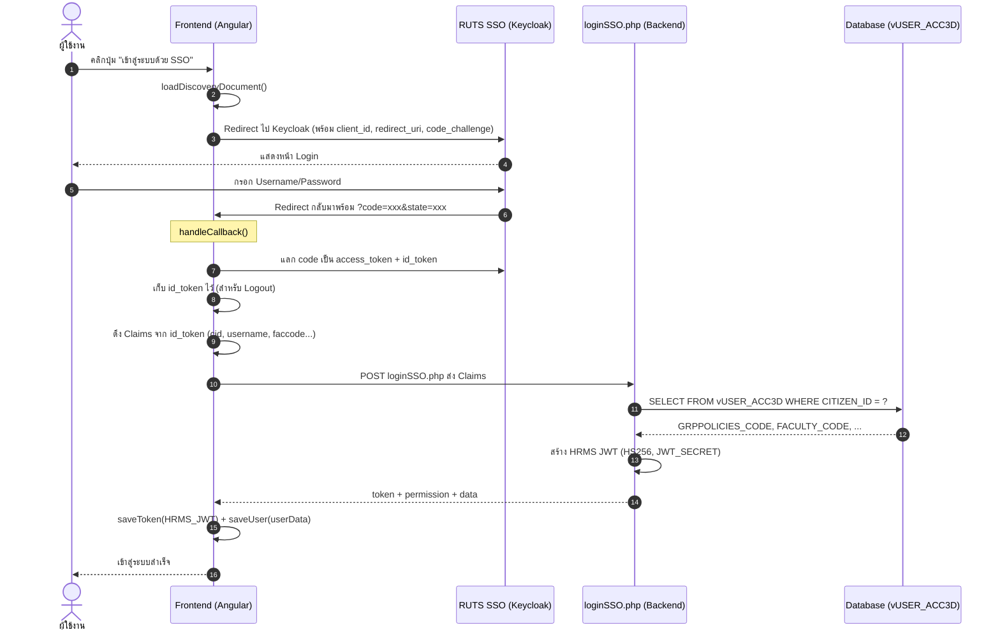
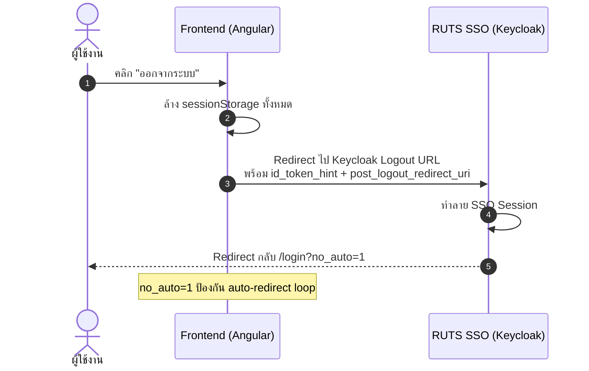

# 📘 พิมพ์เขียว: การเชื่อมต่อ RUTS SSO (Keycloak OIDC) กับระบบ Angular
**จากประสบการณ์จริงกับระบบ HRMS — ฉบับสมบูรณ์พร้อมบทเรียนและแนวทางแก้ไข**

> เอกสารนี้รวบรวมทุกขั้นตอน ทุกปัญหา และทุกวิธีแก้ไขจากการเชื่อมต่อ HRMS เข้ากับ RUTS SSO (Keycloak)
> เพื่อให้ทีมพัฒนานำไปใช้เป็นมาตรฐานในการเชื่อมต่อระบบอื่นๆ ต่อไป

---

## 📋 สารบัญ
1. [สถาปัตยกรรมภาพรวม](#1-สถาปัตยกรรมภาพรวม)
2. [ข้อมูลจาก Keycloak SSO](#2-ข้อมูลจาก-keycloak-sso)
3. [ขั้นตอนการ Implement ทีละส่วน](#3-ขั้นตอนการ-implement)
4. [ปัญหาที่พบและวิธีแก้ไข (11 ปัญหา)](#4-ปัญหาที่พบและวิธีแก้ไข)
5. [Checklist สำหรับระบบใหม่](#5-checklist-สำหรับระบบใหม่)
6. [ไฟล์ที่เกี่ยวข้อง](#6-ไฟล์ที่เกี่ยวข้อง)

---

## 1. สถาปัตยกรรมภาพรวม

### 1.1 Flow การ Login ผ่าน SSO (ที่ถูกต้อง)



### 1.2 Flow การ Logout (RP-Initiated Logout)



### 1.3 SSO ให้อะไรมา vs ระบบต้องการอะไรเพิ่ม

| ข้อมูล | SSO ให้มา | ต้อง Query เพิ่ม |
|--------|:---------:|:---------------:|
| เลขบัตรประชาชน (`cid`) | ✅ | — |
| ชื่อ-นามสกุล | ✅ | — |
| รหัสคณะ (`faccode`) | ✅ | — |
| รหัสวิทยาเขต (`campuscode`) | ✅ | — |
| อีเมล | ✅ | — |
| `GRPPOLICIES_CODE` (สิทธิเข้าระบบ) | ❌ | ✅ จาก `vUSER_ACC3D` |
| HRMS JWT Token (Backend API) | ❌ | ✅ สร้างโดย `loginSSO.php` |

> **SSO = บอกว่า "คุณคือใคร"** / **loginSSO.php = บอกว่า "คุณทำอะไรได้"**

---

## 2. ข้อมูลจาก Keycloak SSO

### 2.1 ข้อมูลการเชื่อมต่อ

| รายการ | ค่า |
|--------|-----|
| SSO Server | `https://sso.apps.rmutsv.ac.th` |
| Realm | `apps` |
| Protocol | OpenID Connect (OIDC / OAuth 2.0) |
| Client ID | `hrms` (เปลี่ยนตามระบบ) |
| Client Secret | ได้จากทีม SSO |
| Discovery URL | `https://sso.apps.rmutsv.ac.th/realms/apps/.well-known/openid-configuration` |

### 2.2 Keycloak UserInfo (Claims ที่ได้หลัง Login)

```json
{
  "sub": "uuid",
  "cid": "1234567890123",
  "username": "john.doe",
  "firstname": "สมชาย",
  "lastname": "ใจดี",
  "email": "john@rmutsv.ac.th",
  "type": "staff",
  "faccode": "K05",
  "facname": "คณะวิทยาศาสตร์ฯ",
  "depcode": "K0501",
  "depname": "สาขาวิทย์คอม",
  "campuscode": "K",
  "campusname": "ไสใหญ่",
  "tokenelogin": "eyJhbG..."
}
```

### 2.3 สิ่งที่ต้องลงทะเบียนใน Keycloak Admin

| การตั้งค่า | Development | Production |
|-----------|-------------|-----------|
| Valid Redirect URIs | `http://localhost:4200/*` | `https://domain.com/*` |
| Post Logout Redirect URIs | `http://localhost:4200/*` | `https://domain.com/*` |
| Web Origins | `http://localhost:4200` | `https://domain.com` |

> [!CAUTION]
> **ถ้า Redirect URI ไม่ตรง จะได้ error "Invalid redirect uri" จาก Keycloak ทันที**

---

## 3. ขั้นตอนการ Implement

### 3.1 Frontend — Angular

#### ติดตั้ง Library
```bash
npm install angular-oauth2-oidc
```

#### Config ตัวอย่าง (`environment.ts`)

```typescript
export const environment = {
  oidc: {
    issuer: 'https://sso.apps.rmutsv.ac.th/realms/apps',
    clientId: 'hrms',                          // เปลี่ยนตามระบบ
    redirectUri: 'http://localhost:4200/login', // ★ ต้องชี้ไปหน้า Login
    postLogoutRedirectUri: 'http://localhost:4200/login',
    scope: 'openid profile email',
    usePkce: true,
    dummyClientSecret: 'xxx',                  // ★ ได้จากทีม SSO
    healthCheckTimeoutMs: 2000,
  },
};
```

#### OIDC Service — โครงสร้างหลัก

```typescript
@Injectable({ providedIn: 'root' })
export class OidcAuthService {
  
  // 1. configure() — ตั้งค่า OAuthService ครั้งเดียว
  
  // 2. login() — ★ ต้อง await loadDiscoveryDocument() ก่อน initCodeFlow()
  async login(): Promise<void> {
    this.configure();
    await this.oauthService.loadDiscoveryDocument();
    this.oauthService.initCodeFlow();
  }
  
  // 3. handleCallback() — หลัง Keycloak redirect กลับ
  async handleCallback(): Promise<boolean> {
    this.configure();
    await this.oauthService.loadDiscoveryDocumentAndTryLogin();
    if (!this.oauthService.hasValidAccessToken()) return false;
    
    // ★ เก็บ id_token ทันที (สำหรับ Logout)
    sessionStorage.setItem('sso-id-token', this.oauthService.getIdToken());
    
    // ★ ส่ง Claims ไป loginSSO.php (Backend สร้าง JWT ให้)
    const claims = this.oauthService.getIdentityClaims();
    const result = await this.http.post('loginSSO.php', claims);
    
    if (result.success) {
      this.tokenStorage.saveToken(result.token);
      this.tokenStorage.saveUser({ ...claims, ...result.data });
      return true;
    }
    return false;
  }
  
  // 4. logout() — ★ ส่ง id_token_hint + no_auto=1
  logout(): void {
    const idToken = sessionStorage.getItem('sso-id-token');
    this.tokenStorage.signOut();
    if (idToken) {
      const logoutUrl = `${issuer}/protocol/openid-connect/logout`;
      const postLogoutUri = window.location.origin + '/login?no_auto=1';
      window.location.href = `${logoutUrl}?post_logout_redirect_uri=...&id_token_hint=${idToken}`;
    }
  }
  
  // 5. healthCheck() — เช็ค SSO Server พร้อมหรือไม่ (2s timeout)
}
```

#### หน้า Login — จุดสำคัญ

```typescript
async ngOnInit() {
  // 1. เช็ค OIDC Callback (code= ใน URL)
  if (window.location.search.includes('code=')) {
    const success = await this.oidcAuth.handleCallback();
    if (success) { this.router.navigate(['/main']); return; }
  }
  
  // 2. ดึง SSO Settings — ★ ล้าง cache ก่อนเสมอ
  this.ssoSettingsService.clearCache();
  this.ssoSettings = await this.ssoSettingsService.getSettings();
  
  // 3. ★ เช็ค ?no_auto=1 ป้องกัน loop
  const noAuto = new URLSearchParams(window.location.search).get('no_auto') === '1';
  
  // 4. ตัดสินใจแสดง UI
  if (ssoEnabled && autoRedirect && !noAuto) { /* auto-redirect */ }
  else if (ssoEnabled) { /* แสดงปุ่ม SSO + form เดิม */ }
  else { /* form เดิมอย่างเดียว */ }
}
```

### 3.2 Backend — `loginSSO.php`

```php
<?php
// 1. รับ Claims จาก Frontend (POST)
$cid = $input['cid'];
$username = $input['username'];

// 2. User Mapping (ถ้าไม่มี cid → หาจาก username)
if (empty($citizenId)) {
    $sql = "SELECT CITIZEN_ID FROM vRUTS_epassport WHERE E_PASSPORT = ?";
}

// 3. ตรวจสิทธิจาก vUSER_ACC3D (★ query DB โดยตรง ไม่พึ่ง JWT claims)
$sql = "SELECT GRPPOLICIES_CODE, FACULTY_CODE, ... 
        FROM vUSER_ACC3D 
        WHERE CITIZEN_ID = ? AND xProgr = '01' AND USERGROUP_ASTATUS = 1";

// 4. สร้าง HRMS JWT (HS256, JWT_SECRET)
$payload = [
    'citizenId' => $citizenId,
    'exp' => time() + 86400,
    'data' => ['accessData' => [
        'GRPPOLICIES_CODE' => $userData['GRPPOLICIES_CODE'],
        'FACULTY_CODE' => $userData['FACULTY_CODE']
    ]]
];

// 5. Return JWT + permission + data
echo json_encode(['success' => true, 'token' => $hrmsToken, ...]);
?>
```

### 3.3 Admin UI — เปิด/ปิด SSO

| สวิตช์ | หน้าที่ |
|--------|--------|
| `SSO_ENABLED` | เปิด/ปิดปุ่ม SSO บนหน้า Login |
| `SSO_AUTO_REDIRECT` | เปิด → redirect ไป SSO ทันทีโดยไม่ต้องกดปุ่ม |

เก็บค่าใน `SYS_CONFIG` table (Backend `ssoSettings.php`)

---

## 4. ปัญหาที่พบและวิธีแก้ไข

### 🔴 ปัญหาที่ 1: หน้า Login หมุนไม่หยุด (Spinner Infinite)

| รายการ | รายละเอียด |
|--------|-----------|
| **อาการ** | หน้า Login แสดง spinner ค้าง ไม่แสดง form |
| **สาเหตุ** | ใช้ `fetch()` ซึ่งทำงาน **นอก Angular Zone** → Angular ไม่ detect ว่า data กลับมา → ไม่ re-render UI |
| **วิธีแก้** | เปลี่ยนจาก `fetch()` → `HttpClient` + `firstValueFrom()` |

```diff
- const result = await fetch(url);
- const json = await result.json();
+ const json = await firstValueFrom(this.http.get(url).pipe(catchError(...)));
```

> [!WARNING]
> **กฎ: ห้ามใช้ `fetch()` ใน Angular Component/Service** — ใช้ `HttpClient` เสมอ

---

### 🔴 ปัญหาที่ 2: กดปุ่ม SSO แล้วไม่ redirect ไป Keycloak

| รายการ | รายละเอียด |
|--------|-----------|
| **อาการ** | กดปุ่ม SSO → spinner แปปเดียว → กลับมาหน้า login เดิม |
| **สาเหตุ** | `initCodeFlow()` ต้องรู้ authorization endpoint จาก Discovery Document แต่ไม่ได้โหลดก่อน |
| **วิธีแก้** | เรียก `await loadDiscoveryDocument()` ก่อน `initCodeFlow()` |

```diff
  async login(): Promise<void> {
    this.configure();
+   await this.oauthService.loadDiscoveryDocument();
    this.oauthService.initCodeFlow();
  }
```

> [!WARNING]
> **กฎ: `login()` ต้องเป็น `async` และ `await loadDiscoveryDocument()` ก่อนเสมอ**

---

### 🔴 ปัญหาที่ 3: Keycloak redirect กลับมาแล้วไม่จับ callback

| รายการ | รายละเอียด |
|--------|-----------|
| **อาการ** | Keycloak redirect กลับมาที่ `/?code=xxx` → Auth Guard redirect ไป `/login` → `code=` หายไป |
| **สาเหตุ** | `redirectUri` ตั้งเป็น root `/` แต่ callback handler อยู่ใน `/login` |
| **วิธีแก้** | เปลี่ยน `redirectUri` ให้ตรงกับหน้าที่มี callback handler |

```diff
- redirectUri: 'http://localhost:4200/',
+ redirectUri: 'http://localhost:4200/login',
```

> [!IMPORTANT]
> **กฎ: `redirectUri` ต้องชี้ไปหน้าที่มี `handleCallback()` อยู่ — ไม่ใช่หน้า root**

---

### 🔴 ปัญหาที่ 4: Token exchange ล้มเหลว (code → token)

| รายการ | รายละเอียด |
|--------|-----------|
| **อาการ** | URL มี `?code=xxx` แล้ว แต่ `hasValidAccessToken()` return `false` — หน้ากระพริบแล้วกลับมา login |
| **สาเหตุ** | Keycloak client เป็น **confidential type** แต่ไม่ได้ส่ง Client Secret ตอนแลก token |
| **วิธีแก้** | ใส่ `dummyClientSecret` ใน environment config |

```diff
- dummyClientSecret: '',
+ dummyClientSecret: 'xxx...xxx',  // ได้จากทีม SSO
```

> [!CAUTION]
> **ถ้า Keycloak client มี Client Secret → ต้องใส่ `dummyClientSecret` เสมอ ไม่งั้น token exchange จะ fail เงียบๆ**

---

### 🔴 ปัญหาที่ 5: บันทึกการตั้งค่า SSO → 403 Forbidden

| รายการ | รายละเอียด |
|--------|-----------|
| **อาการ** | กดบันทึกใน SSO Settings → 403 Forbidden |
| **สาเหตุ** | Backend พยายามดึง `GRPPOLICIES_CODE` จาก JWT payload แต่ JWT จาก eLogin ไม่มี field นี้ |
| **วิธีแก้** | ดึง `citizenId` จาก JWT → query สิทธิจาก `vUSER_ACC3D` โดยตรง |

```php
// ❌ ผิด — JWT อาจไม่มี GRPPOLICIES_CODE
$policy = $tokenData['data']['accessData']['GRPPOLICIES_CODE'];

// ✅ ถูก — query จาก DB โดยตรง
$sql = "SELECT GRPPOLICIES_CODE FROM vUSER_ACC3D WHERE CITIZEN_ID = ?";
```

> [!IMPORTANT]
> **กฎ: อย่าพึ่ง JWT claims สำหรับ authorization** — JWT มาจากหลาย source ที่มี claims ต่างกัน → query DB โดยตรงปลอดภัยที่สุด

---

### 🔴 ปัญหาที่ 6: loginSSO.php reject user ทุกคน

| รายการ | รายละเอียด |
|--------|-----------|
| **อาการ** | SSO login สำเร็จ แต่แสดง "สัญญาจ้างหมดอายุ" |
| **สาเหตุ** | Copy contract check จาก `checkAccess.php` มาโดยไม่จำเป็น — ตาราง `RE_HCONTRACT_STAFF6` ไม่เกี่ยวกับ SSO |
| **วิธีแก้** | ลบ business rule ที่ไม่เกี่ยวออกจาก `loginSSO.php` |

> [!CAUTION]
> **กฎ: อย่า copy business rule จากระบบเดิมมาใส่ SSO Login โดยไม่ถาม — `loginSSO.php` ทำแค่ mapping user + ตรวจสิทธิ + สร้าง JWT**

---

### 🟡 ปัญหาที่ 7: sessionStorage cache ค้าง

| รายการ | รายละเอียด |
|--------|-----------|
| **อาการ** | เปลี่ยนค่า SSO Settings ใน DB แล้วหน้า Login ยังใช้ค่าเก่า |
| **สาเหตุ** | `sso-settings.service.ts` cache ค่าไว้ใน sessionStorage |
| **วิธีแก้** | เรียก `clearCache()` ก่อน `getSettings()` ในหน้า Login เสมอ |

---

### 🟡 ปัญหาที่ 8: Auto-Redirect Loop หลัง Logout

| รายการ | รายละเอียด |
|--------|-----------|
| **อาการ** | Logout → กลับมา `/login` → Auto-Redirect ดีดกลับ SSO → วนลูป |
| **สาเหตุ** | Logout redirect ไม่มีสัญญาณบอกว่ามาจาก Logout |
| **วิธีแก้** | เพิ่ม `?no_auto=1` ใน post_logout_redirect_uri + เช็คใน Login page |

---

### 🟡 ปัญหาที่ 9: Logout ไม่ทำลาย Keycloak Session

| รายการ | รายละเอียด |
|--------|-----------|
| **อาการ** | Logout แล้ว Login ใหม่ไม่ต้องกรอก password |
| **สาเหตุ** | ไม่ได้เก็บ `id_token` และไม่ได้ส่ง `id_token_hint` ตอน Logout |
| **วิธีแก้** | เก็บ `id_token` ทันทีหลัง callback + ส่ง `id_token_hint` ตอน Logout |

---

### 🟡 ปัญหาที่ 10: Keycloak "Invalid redirect uri"

| รายการ | รายละเอียด |
|--------|-----------|
| **อาการ** | กดปุ่ม SSO → Keycloak แสดง error |
| **สาเหตุ** | URL ไม่ตรงกับ Valid Redirect URIs ที่ลงทะเบียน |
| **วิธีแก้** | ให้ทีม SSO เพิ่ม URL ใน Keycloak Admin — ตรวจ `http/https`, `/`, port |

---

### 🟢 ปัญหาที่ 11: SSO ทำซับซ้อนเกินไป

| รายการ | รายละเอียด |
|--------|-----------|
| **อาการ** | ใช้เวลาแก้ bug นาน เพราะ flow ซับซ้อน |
| **สาเหตุ** | ไม่ได้ทำตาม `sso_implementation_guide.md` — สร้าง flow เอง |
| **วิธีแก้** | ยึด Guide เป็นหลัก — Redirect → Get Token → Send Claims to Backend → Save JWT → Done |

> [!TIP]
> **กฎทอง: SSO ต้องง่าย — Redirect → Get Token → Send Claims to Backend → Save JWT → Done**

---

## 5. Checklist สำหรับระบบใหม่

### ก่อนเริ่มพัฒนา
- [ ] ได้ Client ID + Client Secret จากทีม SSO
- [ ] ลงทะเบียน Redirect URIs ใน Keycloak Admin (ทั้ง dev + prod)
- [ ] ลงทะเบียน Post Logout Redirect URIs
- [ ] ลงทะเบียน Web Origins (CORS)
- [ ] ทดสอบ Discovery URL เข้าถึงได้

### Frontend
- [ ] ติดตั้ง `angular-oauth2-oidc`
- [ ] `environment.ts` — issuer, clientId, **redirectUri ชี้ไปหน้า Login**, **dummyClientSecret**
- [ ] `app.config.ts` — เพิ่ม `provideOAuthClient()`
- [ ] `oidc-auth.service.ts` — login, handleCallback, logout, healthCheck
- [ ] `login()` ต้อง `await loadDiscoveryDocument()` ก่อน `initCodeFlow()`
- [ ] `handleCallback()` เก็บ `id_token` ทันที
- [ ] `handleCallback()` ส่ง Claims ไป Backend (`loginSSO.php`)
- [ ] `logout()` ส่ง `id_token_hint` + `post_logout_redirect_uri=/login?no_auto=1`
- [ ] หน้า Login เช็ค `?no_auto=1` ป้องกัน auto-redirect loop
- [ ] ใช้ `HttpClient` เท่านั้น (**ห้ามใช้ `fetch()`**)
- [ ] ล้าง sessionStorage cache ก่อนดึง SSO Settings ใหม่

### Backend
- [ ] สร้าง `loginSSO.php` (รับ Claims → ตรวจสิทธิจาก DB → สร้าง JWT)
- [ ] ตรวจสิทธิจาก **Database โดยตรง** (ไม่พึ่ง JWT claims)
- [ ] **อย่า copy business rule ที่ไม่เกี่ยวมาจากระบบเดิม**
- [ ] สร้าง `ssoSettings.php` (getSettings = public, saveSettings = Admin only)

### Admin UI
- [ ] สวิตช์เปิด/ปิด SSO
- [ ] สวิตช์ Auto-Redirect
- [ ] Health Check indicator
- [ ] แสดงเฉพาะ Admin

### ทดสอบ
- [ ] Login ธรรมดา (username/password) ใช้งานได้ปกติ
- [ ] กดปุ่ม SSO → redirect ไป Keycloak
- [ ] Login ที่ Keycloak → redirect กลับ → เข้าระบบสำเร็จ
- [ ] Logout → ทำลาย Keycloak session
- [ ] Logout ไม่มี auto-redirect loop
- [ ] SSO Server ล่ม → Health Check fail → แสดง form login เดิม
- [ ] ปิด SSO จาก Admin → แสดง form เดิมอย่างเดียว
- [ ] ระบบเดิมทั้งหมด (CRUD, เมนู, สิทธิ) ทำงานปกติหลังเปิด SSO

---

## 6. ไฟล์ที่เกี่ยวข้อง

### Frontend
| ไฟล์ | หน้าที่ |
|------|--------|
| `environment.ts` | OIDC Config |
| `app.config.ts` | provideOAuthClient() |
| `oidc-auth.service.ts` | Core OIDC Logic |
| `sso-settings.service.ts` | SSO Settings API |
| `login.ts` / `login.html` | SSO Button + Callback |
| `header.ts` | SSO Logout + Admin Menu |

### Backend
| ไฟล์ | หน้าที่ |
|------|--------|
| `loginSSO.php` | SSO Login API (Claims → JWT) |
| `ssoSettings.php` | SSO Settings CRUD |
| `auth_middleware.php` | JWT Validation |

### เอกสารอ้างอิง
| ไฟล์ | หน้าที่ |
|------|--------|
| `docs/sso_implementation_guide.md` | Guide ต้นฉบับจากระบบ PVMS |
| `docs/sso_blueprint_hrms.md` | เอกสารนี้ |

---

> **เอกสารนี้ปรับปรุงล่าสุด: 18 กันยายน 2569**
> **จากการ implement จริงกับระบบ HRMS → SSO ทำงานสำเร็จ**
